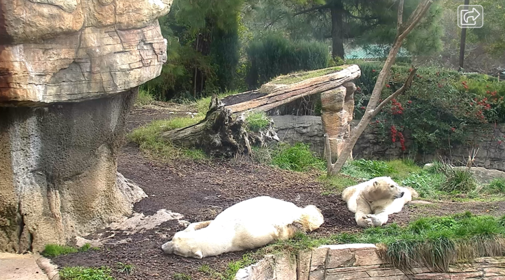
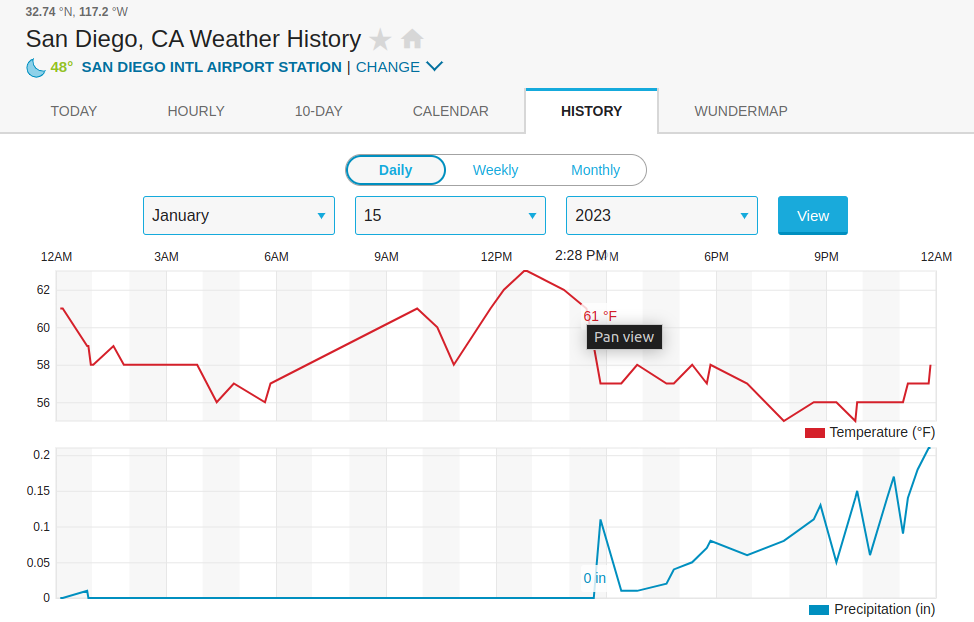
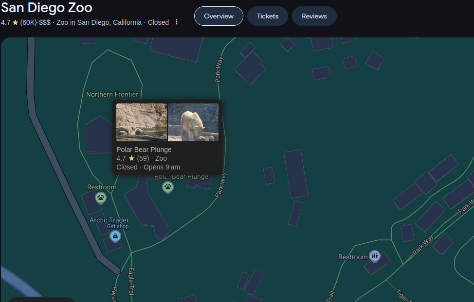

# *OSINT Exercise #005*

**- In which zoo are these polar bears located?**

    As it was a screenshot of a live camera, i first tried to search for live zoo cameras for polare bears, the fisrt result was the San diego zoo, after searching for some pictures i found similar stones and location like in the picture.

***The answer: San diego zoo***

  

    
    
  

**- What was the temperature at the time of the screenshot?**

**- What were the exact coordinates of where the bears were lying down?**

***The answer: 32.73445438911707, -117.15456372426955***
