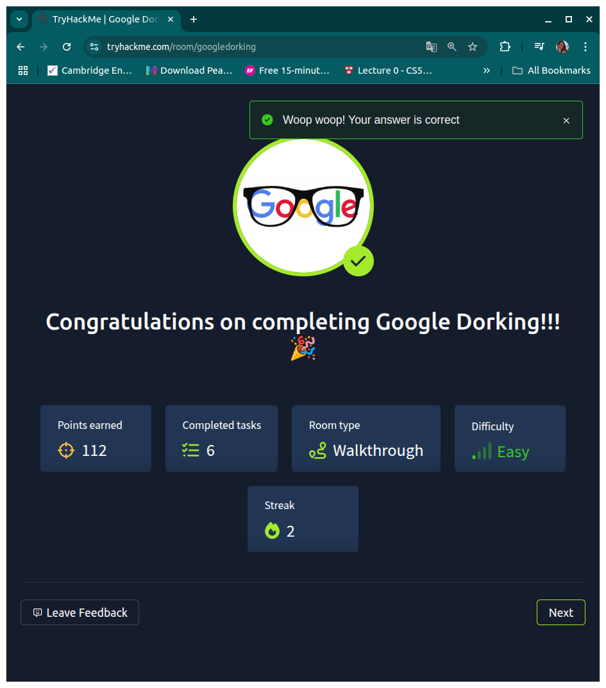

# Google Dorking - TryHackMe Walkthrough

## Introduction
Google Dorking, also known as Google Hacking, is a technique used to find sensitive information using advanced Google search queries. This documentation covers how I completed the TryHackMe "Google Dorking" room and the key lessons learned.

## Steps to Complete the Room

### 1. Understanding Google Dorking
Before starting the challenge, I learned that Google allows advanced search operators that help refine search results. These operators can be used to discover exposed files, misconfigured websites, and even vulnerable web pages.

### 2. Using Basic Search Operators
The room introduced me to fundamental Google search operators such as:
- `site:` – Restricts search results to a specific domain.
  - Example: `site:example.com`
- `filetype:` – Searches for specific file types (e.g., PDF, TXT, DOC).
  - Example: `filetype:pdf site:example.com`
- `intitle:` – Searches for specific words in the title of a webpage.
  - Example: `intitle:"index of"`
- `inurl:` – Looks for specific words within URLs.
  - Example: `inurl:admin`

### 3. Finding Sensitive Information
By applying these operators, I was able to:
- Discover login pages (`inurl:login`)
- Locate exposed directories (`intitle:"index of"`)
- Identify publicly accessible configuration files (`filetype:env OR filetype:log`)

### 4. Practical Exercises
During the room, I completed challenges that involved:
- Finding publicly accessible usernames and passwords.
- Extracting metadata from publicly available documents.
- Identifying websites with open directories.

### 5. Ethical Considerations
The room emphasized that Google Dorking should only be used for ethical purposes, such as penetration testing, securing systems, and vulnerability assessments. Unauthorized access to sensitive data is illegal and unethical.

## Lessons Learned
1. **Importance of Search Operators** – Google Dorking is a powerful skill for OSINT (Open-Source Intelligence) and cybersecurity research.
2. **Risk of Misconfigured Servers** – Many websites expose sensitive files due to poor configurations.
3. **Metadata Extraction** – Documents uploaded online may contain metadata revealing sensitive details.
4. **Legal and Ethical Use** – Google Dorking should be used responsibly to enhance cybersecurity, not exploit vulnerabilities.

## Conclusion
The TryHackMe "Google Dorking" room provided hands-on experience in advanced search techniques, demonstrating how information is unintentionally exposed on the internet. By understanding and using these search operators, I can improve security awareness and help organizations mitigate risks related to publicly accessible data.

