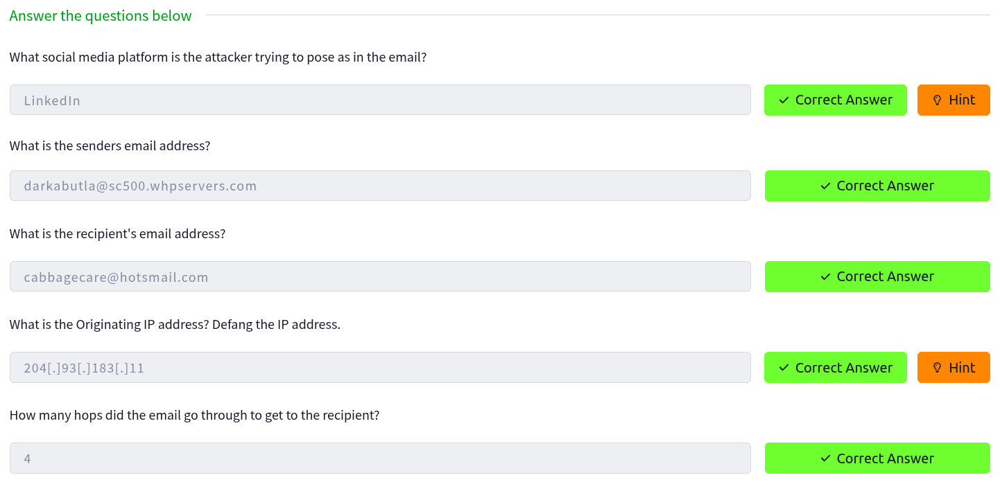

## Threat Intelligence Tools

### UrlScan.io

In this task, we need to find the necessary information from a screenshot where [tryhackme.com](https://tryhackme.com/) was scanned on [urlscan.io](https://urlscan.io/)

In the next image, all the necessary information is highlighted.

#### Questions and Answers

---

### Abuse.ch

#### Question 1: <i>The IOC `212.192.246.30:5555` is identified under which malware alias name on ThreatFox?</i>

To answer this question on [ThreatFox](https://threatfox.abuse.ch/), click on **Browse IOCs → Access database**, then enter `ioc:212.192.246.30:5555` in the search field.

Then, click on **Mirai** in the **Malware** field, and you will see the **Malware alias**.

**Ansewr**: <i>Katana</i>

#### Question 2: Which malware is associated with the JA3 Fingerprint `51c64c77e60f3980eea90869b68c58a8` on SSL Blacklist?

To answer this question on [SSLBL](https://sslbl.abuse.ch/), click on **JA3 Fingerprints → View details**, then enter `51c64c77e60f3980eea90869b68c58a8` in the search field.

**Ansewr**: <i>Dridex</i>

#### Question 3: From the statistics page on URLHaus, what malware-hosting network has the ASN number `AS14061`? 

To answer this question on [URLhaus Statistics](https://urlhaus.abuse.ch/statistics/), and scroll down.

**Ansewr**: <i>DIGITALOCEAN-ASN</i>

#### Question 4: Which country is the botnet IP address `178.134.47.166` associated with according to FeodoTracker?

To answer this question on [Feodo Tracker](https://feodotracker.abuse.ch/), click on **Botnet C&Cs
 → View details**, then enter `178.134.47.166` in the search field.

**Ansewr**: <i>Georgia</i>

#### Questions and Answers

### PhishTool

Click the **Start Machine** button to start the attached VM and open it in Split View.

In the opened VM, go to the **Emails** folder and double-click on **Email1.eml**. In the opened application, you will find the answers to the first three questions.

For the remaining questions, click on **View Source**, where you will see that the email was **Received** four times. The sender's IP address should be written in the format **X[.]X[.]X[.]X** to be considered valid.

#### Questions and Answers

### Cisco Talos Intelligence

To solve this task on [Talos Intelligence](https://talosintelligence.com/), enter `204.93.183.11` in the search field.

And we will see the answer to the first question.

For the next question, go to [DNSChecker](https://dnschecker.org/ip-whois-lookup.php), enter **204.93.183.11** in the search field, and you will see the answer to the second question.

#### Questions and Answers

### Scenario 1

In the opened VM, go to the **Emails** folder and double-click on **Email2.eml**. In the opened application, you will find the answers to the first question.

For the second question, go to **VirusTotal** and upload **Email2.eml**.

#### Questions and Answers

### Scenario 2

For this task, we will use [PhishTool](https://app.phishtool.com/). Upload **Email3.eml**, go to the **Attachments** tab, and you will see the answer to the first question.

Copy the SHA-256 hash and open [Talos Intelligence](https://talosintelligence.com/) and check the reputation of the file.

